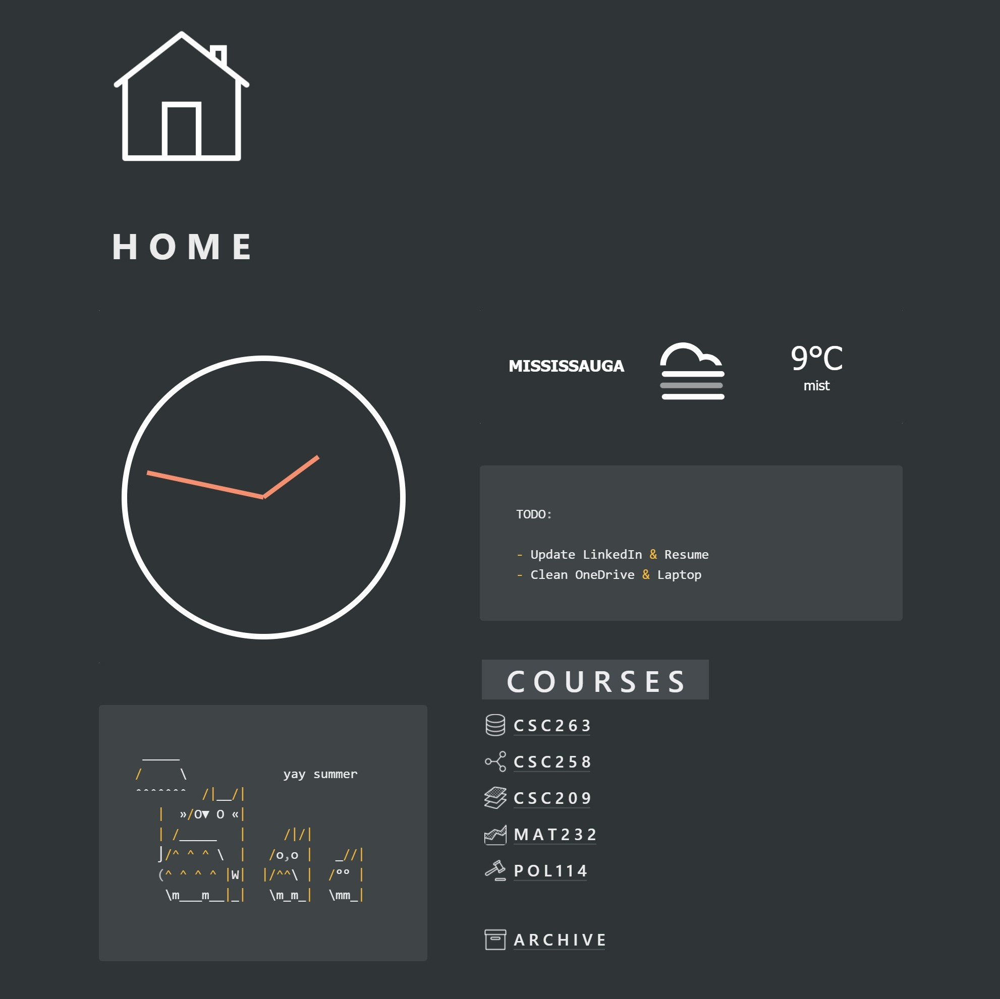

# notion

> notion hosts widgets for Notion pages.

## Usage

Embed widget links are given by `anthonytedja.github.io/notion/<filename>.html`

- Copy the URL for the widget you want in your notion page. Check out the preview section and click on the widget you want to take you to the URL
- Paste the URL into Notion and choose "create embed"

## Preview

## Features

- Mobile friendly
- Supports both light and dark modes

## Built With

- CodePen
- Visual Studio Code
