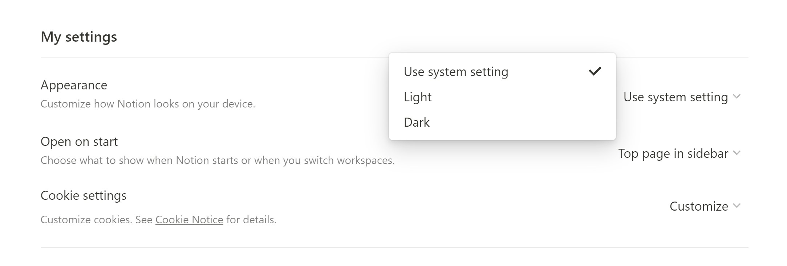

# notion

> notion hosts widgets for Notion pages.

## Setup & Usage

Embed widget links are given by `anthonytedja.github.io/notion/<widget-name>/`

> **_IMPORTANT:_**  Use system settings for appearance on desktop to match the theme style.

- Click on the widget image in the preview section below to take you to the widget site.
- Copy the URL and paste the link into Notion and choose "Create embed"
- Resize the widget to how you want and you're all set up!

## Preview

`Pomodoro` : [Pomodoro](https://todoist.com/productivity-methods/pomodoro-technique) is a productivity technique where a 25 minute work session is followed by a 5 minute break for each pomodoro period. Click on the timer to start the countdown, or double / triple click to switch the timer modes from work to break. A notification will be played when the timer hits 0 so you don't need to keep your eyes on the widget.

`Weather` : Powered by [weatherwidget.io](https://weatherwidget.io/), get real time weather updates in the Toronto Area.

`Clock` : Analog display of local time.

`Time` : Display local time in English text, a fork from [Text Clock](https://github.com/searleb/text-clock-chrome).

`Cat` : Poke the sleepy cat to see it roll over and yawn!

`Kirby` : Poke Kirby to wake it up from its sleep!

`Rimuru` : Poke Rimuru the Slime to see it jump! Pixel Artist: [pixelcatto](https://www.deviantart.com/pixelcatto/art/Rimuru-Tempest-animation-784802109).

`Bunny` : Poke the chubby bunny to see it try and catch its breath!

## Features

- Supported for Mobile App and Desktop Page
- ~V2: JS Local Storage to save theme settings~
- V3: JS Media Queries to automatically match theme settings

## Built With

- CodePen
- Visual Studio Code
